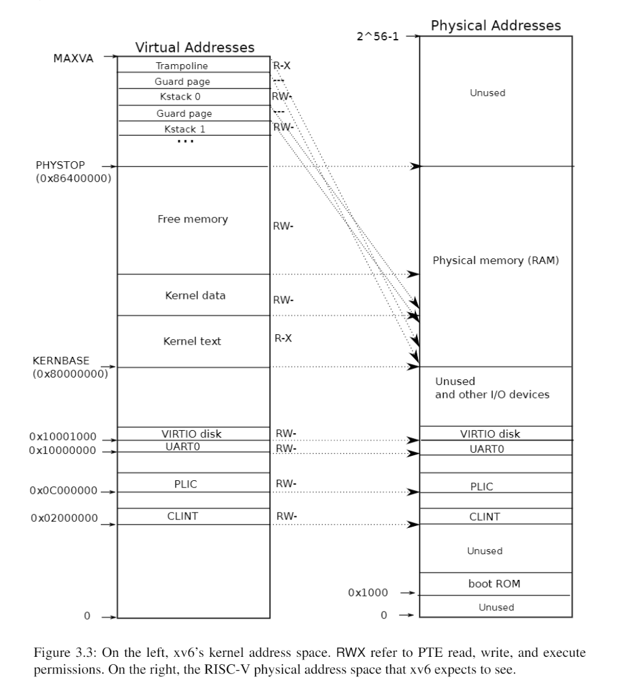

# Kernal Memory

XV6 为每个进程维护一个页表,用来描述每个进程的用户地址空间,外加一个单独描述内核地址空间的页表

内核配置其地址空间的布局,以允许自己可以预测的虚拟地址访问物理内存和各种硬件资源

内核虚拟地址映射到物理地址

QEMU模拟了一台计算机，它包括从物理地址0x80000000开始并至少到0x86400000结束的RAM（物理内存），xv6称结束地址为PHYSTOP。QEMU模拟还包括I/O设备，如磁盘接口。QEMU将设备接口作为内存映射控制寄存器暴露给软件，这些寄存器位于物理地址空间0x80000000以下。内核可以通过读取/写入这些特殊的物理地址与设备交互；这种读取和写入与设备硬件而不是RAM通信。

内核使用“直接映射”获取内存和内存映射设备寄存器；也就是说，将资源映射到等于物理地址的虚拟地址。例如，内核本身在虚拟地址空间和物理内存中都位于KERNBASE=0x80000000。直接映射简化了读取或写入物理内存的内核代码。例如，当fork为子进程分配用户内存时，分配器返回该内存的物理地址；fork在将父进程的用户内存复制到子进程时直接将该地址用作虚拟地址。

这段话描述的是操作系统内核中一种非常经典且高效的内存管理策略——**直接映射（Direct Mapping）**。

简单来说，它的核心思想是：**为了让内核代码写起来更简单、跑得更快，内核把物理内存“平移”到了虚拟地址空间中，使得虚拟地址和物理地址之间只相差一个固定的数值（偏移量）。**

为了让你透彻理解这段话，我们可以从以下三个维度来拆解：

### 1. 什么是“直接映射”？（平移的概念）

通常，虚拟地址（VA）到物理地址（PA）的转换是非常复杂的，需要通过多级页表来查表（就像查字典一样）。

但在**直接映射**中，内核给自己划定了一块虚拟地址区域（通常是从 `KERNBASE` 开始，比如 `0x80000000`），这块区域和物理内存是**一一对应**的。

**公式非常简单：**
$$虚拟地址 = 物理地址 + KERNBASE$$
$$物理地址 = 虚拟地址 - KERNBASE$$

**举个例子（基于你提供的 `0x80000000`）：**
*   **物理内存的第 0 个字节**（地址 `0x00000000`），被映射到了内核虚拟地址 `0x80000000`。
*   **物理内存的第 100 个字节**（地址 `0x00000064`），被映射到了内核虚拟地址 `0x80000064`。
*   **物理内存的第 1MB 处**（地址 `0x00100000`），被映射到了内核虚拟地址 `0x80100000`。

**为什么要这么做？**
这就好比你把家里的家具（物理内存）原封不动地搬到了新房子（虚拟地址空间）的同一个位置，只是新房子的门牌号（虚拟地址）整体加了个前缀。这样你找东西的时候，根本不需要查地图（页表），直接心算一下偏移量就能找到了。

### 2. 为什么说它“简化了内核代码”？

这段话里提到了 `fork` 的例子，我们来具体看看它是怎么简化的。

**场景：** 内核正在执行 `fork` 系统调用，为子进程分配了一块物理内存（假设物理地址是 `0x00100000`），现在内核想要把父进程的数据复制到这快新内存里。

*   **如果没有直接映射：**
    内核拿到物理地址 `0x00100000` 后，不能直接读写。CPU 只能操作虚拟地址。内核必须先调用复杂的函数（如 `kmap` 或修改页表），把这个物理地址“临时映射”到某个虚拟地址，才能进行 `memcpy` 操作。这非常麻烦且慢。

*   **有了直接映射（文中的情况）：**
    内存分配器告诉 `fork`：“我给了你物理地址 `0x00100000`”。
    `fork` 代码只需要做一个简单的加法：`0x00100000 + 0x80000000 = 0x80100000`。
    然后，内核直接对 `0x80100000` 进行写入操作。
    **结果：** 硬件（MMU）会自动根据直接映射的规则，把这个写操作导向物理地址 `0x00100000`。

**结论：** 内核代码不需要关心复杂的页表查找，只需要简单地加上 `KERNBASE` 就能访问任何物理内存。

### 3. 关于“内存映射设备寄存器”

文中还提到“内核使用直接映射获取...内存映射设备寄存器”。

硬件设备（如串口、网卡）的寄存器通常也是挂在物理内存地址上的（MMIO）。
比如，串口发送寄存器的物理地址可能是 `0x10000000`。

*   通过直接映射，这个物理地址会被自动映射到虚拟地址 `0x90000000`（`0x10000000 + 0x80000000`）。
*   当内核想要向串口发送数据时，只需要写代码 `*(volatile uint32*)0x90000000 = data;`。
*   这行代码看起来像是在写内存，实际上硬件会自动把它导向串口寄存器，从而发送数据。

### 总结

这段话的核心含义是：

1.  **布局：** 内核在虚拟地址空间的高地址部分（`KERNBASE` 以上），为所有物理内存建立了一个**“镜像”**。
2.  **规则：** 这个镜像和物理内存是完全线性的，只差一个固定的偏移量。
3.  **好处：** 当内核需要操作物理内存（无论是分配给用户进程的内存，还是硬件寄存器）时，不需要查复杂的页表，直接通过**指针运算（加上偏移量）**就能访问。这极大地提高了内核访问内存的效率并简化了代码逻辑。

有几个内核虚拟地址不是直接映射：

* 蹦床页面(trampoline page)。它映射在虚拟地址空间的顶部；用户页表具有相同的映射。第4章讨论了蹦床页面的作用，但我们在这里看到了一个有趣的页表用例；一个物理页面（持有蹦床代码）在内核的虚拟地址空间中映射了两次：一次在虚拟地址空间的顶部，一次直接映射。

* 内核栈页面。每个进程都有自己的内核栈，它将映射到偏高一些的地址，这样xv6在它之下就可以留下一个未映射的保护页(guard page)。保护页的PTE是无效的（也就是说PTE_V没有设置），所以如果内核溢出内核栈就会引发一个异常，内核触发panic。如果没有保护页，栈溢出将会覆盖其他内核内存，引发错误操作。恐慌崩溃（panic crash）是更可取的方案。（注：Guard page不会浪费物理内存，它只是占据了虚拟地址空间的一段靠后的地址，但并不映射到物理地址空间。）
虽然内核通过高地址内存映射使用内核栈，是它们也可以通过直接映射的地址进入内核。另一种设计可能只有直接映射，并在直接映射的地址使用栈。然而，在这种安排中，提供保护页将涉及取消映射虚拟地址，否则虚拟地址将引用物理内存，这将很难使用。

内核在权限PTE_R和PTE_X下映射蹦床页面和内核文本页面。内核从这些页面读取和执行指令。内核在权限PTE_R和PTE_W下映射其他页面，这样它就可以读写那些页面中的内存。对于保护页面的映射是无效的。

每个RISC-V CPU都将页表条目缓存在转译后备缓冲器（快表/TLB）中，当xv6更改页表时，它必须告诉CPU使相应的缓存TLB条目无效。如果没有这么做，那么在某个时候TLB可能会使用旧的缓存映射，指向一个在此期间已分配给另一个进程的物理页面，这样会导致一个进程可能能够在其他进程的内存上涂鸦。RISC-V有一个指令sfence.vma，用于刷新当前CPU的TLB。xv6在重新加载satp寄存器后，在kvminithart中执行sfence.vma，并在返回用户空间之前在用于切换至一个用户页表的trampoline代码中执行sfence.vma (kernel/trampoline.S:79)。
