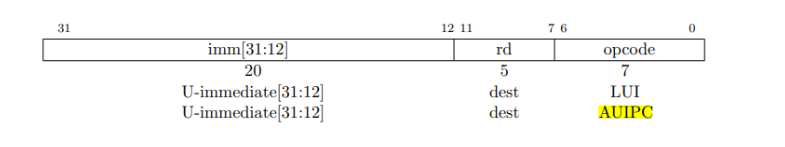
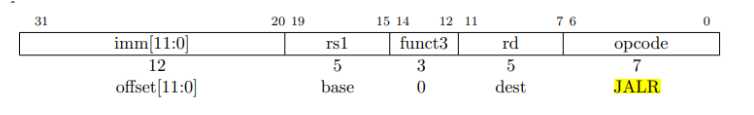

```assembly

user/_call:     file format elf64-littleriscv


Disassembly of section .text:

0000000000000000 <g>:
#include "kernel/param.h"
#include "kernel/types.h"
#include "kernel/stat.h"
#include "user/user.h"

int g(int x) {
   0:	1141                	addi	sp,sp,-16
   2:	e422                	sd	s0,8(sp)
   4:	0800                	addi	s0,sp,16
  return x+3;
}
   6:	250d                	addiw	a0,a0,3
   8:	6422                	ld	s0,8(sp)
   a:	0141                	addi	sp,sp,16
   c:	8082                	ret

000000000000000e <f>:

int f(int x) {
   e:	1141                	addi	sp,sp,-16
  10:	e422                	sd	s0,8(sp)
  12:	0800                	addi	s0,sp,16
  return g(x);
}
  14:	250d                	addiw	a0,a0,3
  16:	6422                	ld	s0,8(sp)
  18:	0141                	addi	sp,sp,16
  1a:	8082                	ret

000000000000001c <main>:

void main(void) {
  1c:	1141                	addi	sp,sp,-16
  1e:	e406                	sd	ra,8(sp)
  20:	e022                	sd	s0,0(sp)
  22:	0800                	addi	s0,sp,16
  printf("%d %d\n", f(8)+1, 13);
  24:	4635                	li	a2,13
  26:	45b1                	li	a1,12
  28:	00000517          	auipc	a0,0x0
  2c:	7a850513          	addi	a0,a0,1960 # 7d0 <malloc+0xea>
  30:	00000097          	auipc	ra,0x0
  34:	5f8080e7          	jalr	1528(ra) # 628 <printf>
  exit(0);
  38:	4501                	li	a0,0
  3a:	00000097          	auipc	ra,0x0
  3e:	276080e7          	jalr	630(ra) # 2b0 <exit>

0000000000000042 <strcpy>:
#include "kernel/fcntl.h"
#include "user/user.h"
```

(1). 在a0-a7中存放参数，13存放在a2中

(2). 在C代码中，main调用f，f调用g。而在生成的汇编中，main函数进行了内联优化处理。

从代码li a1,12可以看出，main直接计算出了结果并储存

(3). 在0x628

(4). auipc(Add Upper Immediate to PC)：auipc rd imm，将高位立即数加到PC上，从下面的指令格式可以看出，该指令将20位的立即数左移12位之后（右侧补0）加上PC的值，将结果保存到dest位置，图中为rd寄存器



下面来看jalr (jump and link register)：jalr rd, offset(rs1)跳转并链接寄存器。jalr指令会将当前PC+4保存在rd中，然后跳转到指定的偏移地址offset(rs1)。



第一行代码：00000097H=00...0 0000 1001 0111B，对比指令格式，可见imm=0，dest=00001，opcode=0010111，对比汇编指令可知，auipc的操作码是0010111，ra寄存器代码是00001。这行代码将0x0左移12位（还是0x0）加到PC（当前为0x30）上并存入ra中，即ra中保存的是0x30

ra中保存的是0x30，加上0x600后为0x628，即printf的地址，执行此行代码后，将跳转到printf函数执行，并将PC+4=0X34+0X4=0X38保存到ra中，供之后返回使用。

在下面的代码中，“y=”之后将打印什么(注：答案不是一个特定的值）？为什么会发生这种情况？
printf("x=%d y=%d", 3);

 原本需要两个参数，却只传入了一个，因此y=后面打印的结果取决于之前a2中保存的数据

 