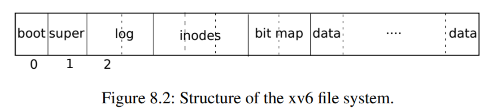

# Filesystem

xv6文件系统实现分为七层
1. 磁盘层读取和写入virtio硬盘上的块
2. 缓冲区高速缓存层（Buffer cache）缓存磁盘块并同步对它们的访问，确保每次只有一个内核可以修改存储在任何特定块中的数据
3. 日志记录层允许更高层在一次事务中奖更新包装到多个块,并确保在遇到崩溃时自动更新这些块
4. 索引节点（Inode）:提供单独的文件,每个文件表示为一个索引节点，其中包含唯一的索引号和一些保存文件数据的块
5. 目录层将每个目录实现为一种特殊的索引节点,其内容是一系列目录项,每个目录项包含文件名和索引号
6. 路径名层提供了分层路径名,并通过递归查找来解析它们
7. 文件描述符使用文件系统接口抽象了Unix资源

文件系统必须有将索引节点和内容块存储在磁盘上哪些位置的方案。为此，xv6将磁盘划分为几个部分，如图8.2所示。文件系统不使用块0（它保存引导扇区）。块1称为超级块：它包含有关文件系统的元数据（文件系统大小（以块为单位）、数据块数、索引节点数和日志中的块数）。从2开始的块保存日志。日志之后是索引节点，每个块有多个索引节点。然后是位图块，跟踪正在使用的数据块。其余的块是数据块：每个都要么在位图块中标记为空闲，要么保存文件或目录的内容。超级块由一个名为mkfs的单独的程序填充，该程序构建初始文件系统。

## Buffer cache

其有两个任务:
1. 同步对磁盘块的访问,以确保磁盘块在内存中只有一个副本,并且一次只有一个内核线程使用该副本
2. 缓存常用块,以便不需要从慢速磁盘重新读取它们

Buffer cache层导出的主接口主要是bread和bwrite；前者获取一个buf，其中包含一个可以在内存中读取或修改的块的副本，后者将修改后的缓冲区写入磁盘上的相应块。内核线程必须通过调用brelse释放缓冲区。Buffer cache每个缓冲区使用一个睡眠锁，以确保每个缓冲区（因此也是每个磁盘块）每次只被一个线程使用；bread返回一个上锁的缓冲区，brelse释放该锁。

让我们回到Buffer cache。Buffer cache中保存磁盘块的缓冲区数量固定，这意味着如果文件系统请求还未存放在缓存中的块，Buffer cache必须回收当前保存其他块内容的缓冲区。Buffer cache为新块回收最近使用最少的缓冲区。这样做的原因是认为最近使用最少的缓冲区是最不可能近期再次使用的缓冲区。

Buffer cache是以双链表表示的缓冲区。main（kernel/main.c:27）调用的函数binit使用静态数组buf（kernel/bio.c:43-52）中的NBUF个缓冲区初始化列表。对Buffer cache的所有其他访问都通过bcache.head引用链表，而不是buf数组。

缓冲区有两个与之关联的状态字段。字段valid表示缓冲区是否包含块的副本。字段disk表示缓冲区内容是否已交给磁盘，这可能会更改缓冲区（例如，将数据从磁盘写入data）。

Bread（kernel/bio.c:93）调用bget为给定扇区（kernel/bio.c:97）获取缓冲区。如果缓冲区需要从磁盘进行读取，bread会在返回缓冲区之前调用virtio_disk_rw来执行此操作。

Bget（kernel/bio.c:59）扫描缓冲区列表，查找具有给定设备和扇区号（kernel/bio.c:65-73）的缓冲区。如果存在这样的缓冲区，bget将获取缓冲区的睡眠锁。然后Bget返回锁定的缓冲区。

如果对于给定的扇区没有缓冲区，bget必须创建一个，这可能会重用包含其他扇区的缓冲区。它再次扫描缓冲区列表，查找未在使用中的缓冲区（b->refcnt = 0）：任何这样的缓冲区都可以使用。Bget编辑缓冲区元数据以记录新设备和扇区号，并获取其睡眠锁。注意，b->valid = 0的布置确保了bread将从磁盘读取块数据，而不是错误地使用缓冲区以前的内容。

每个磁盘扇区最多有一个缓存缓冲区是非常重要的，并且因为文件系统使用缓冲区上的锁进行同步，可以确保读者看到写操作。Bget的从第一个检查块是否缓存的循环到第二个声明块现在已缓存（通过设置dev、blockno和refcnt）的循环，一直持有bcache.lock来确保此不变量。这会导致检查块是否存在以及（如果不存在）指定一个缓冲区来存储块具有原子性。

bget在bcache.lock临界区域之外获取缓冲区的睡眠锁是安全的，因为非零b->refcnt防止缓冲区被重新用于不同的磁盘块。睡眠锁保护块缓冲内容的读写，而bcache.lock保护有关缓存哪些块的信息。

如果所有缓冲区都处于忙碌，那么太多进程同时执行文件系统调用；bget将会panic。一个更优雅的响应可能是在缓冲区空闲之前休眠，尽管这样可能会出现死锁。

一旦bread读取了磁盘（如果需要）并将缓冲区返回给其调用者，调用者就可以独占使用缓冲区，并可以读取或写入数据字节。如果调用者确实修改了缓冲区，则必须在释放缓冲区之前调用bwrite将更改的数据写入磁盘。Bwrite（kernel/bio.c:107）调用virtio_disk_rw与磁盘硬件对话。

当调用方使用完缓冲区后，它必须调用brelse来释放缓冲区(brelse是b-release的缩写，这个名字很隐晦，但值得学习：它起源于Unix，也用于BSD、Linux和Solaris）。brelse（kernel/bio.c:117）释放睡眠锁并将缓冲区移动到链表的前面（kernel/bio.c:128-133）。移动缓冲区会使列表按缓冲区的使用频率排序（意思是释放）：列表中的第一个缓冲区是最近使用的，最后一个是最近使用最少的。bget中的两个循环利用了这一点：在最坏的情况下，对现有缓冲区的扫描必须处理整个列表，但首先检查最新使用的缓冲区（从bcache.head开始，然后是下一个指针），在引用局部性良好的情况下将减少扫描时间。选择要重用的缓冲区时，通过自后向前扫描（跟随prev指针）选择最近使用最少的缓冲区。

## 日志层

文件系统设计中最有趣的问题之一是崩溃恢复。出现此问题的原因是，许多文件系统操作都涉及到对磁盘的多次写入，并且在完成写操作的部分子集后崩溃可能会使磁盘上的文件系统处于不一致的状态。例如，假设在文件截断（将文件长度设置为零并释放其内容块）期间发生崩溃。根据磁盘写入的顺序，崩溃可能会留下对标记为空闲的内容块的引用的inode，也可能留下已分配但未引用的内容块。

已分配未引用一般为良性问题,但是引用已经释放了的inode在重启后出导致严重问题:
重启后,内核可能会将该块分配给另一个文件,现在我们有两个不同的文件无意中指向了同一块,如果xv6支持多个用户
旧文件的所有者能够读取和写入新文件的块,而新文件的所有者是另一个用户

xv6通过简单日志记录解决文件操作系统的崩溃问题,xv6系统调用不会直接写入磁盘上的文件系统数据结构，相反它会在磁盘log中放置它希望进行的所有磁盘写入的描述
一旦系统调用记录了它所有写入操作,它就会向磁盘写入一条commit记录,表明日志包含了一个完整的操作
此时,系统调用将写操作复制到磁盘上的文件系统数据结构,完成这些写入后,系统调用将擦除磁盘上的日志

如果系统崩溃并重新启动，则在运行任何进程之前，文件系统代码将按如下方式从崩溃中恢复:

如果日志标记为完整的操作,则恢复代码会将写操作复制到磁盘文件系统中它们所属的位置,如果日志没有标记为包含完整操作,则恢复代码将忽略该日志，恢复代码通过擦除日志完成

如果崩溃发生在操作提交之前,那么磁盘上的登录将不会被标记为已完成,恢复代码将忽略它
并且磁盘的状态将如操作尚未启动一样,如果崩溃发生在操作提交之后,则恢复将重操作所有的写入操作
如果操作已开始将它们写入磁盘数据结构,则可能会重复操作
在任何一种情况下，日志都会使操作在崩溃时成为原子操作：恢复后，要么操作的所有写入都显示在磁盘上，要么都不显示。

日志驻留在超级块中指定的已知固定位置。它由一个头块（header block）和一系列更新块的副本（logged block）组成。头块包含一个扇区号数组（每个logged block对应一个扇区号）以及日志块的计数。磁盘上的头块中的计数或者为零，表示日志中没有事务；或者为非零，表示日志包含一个完整的已提交事务，并具有指定数量的logged block。在事务提交（commit）时Xv6才向头块写入数据，在此之前不会写入，并在将logged blocks复制到文件系统后将计数设置为零。因此，事务中途崩溃将导致日志头块中的计数为零；提交后的崩溃将导致非零计数。

每个系统调用的代码都指示写入序列的起止，考虑到崩溃，写入序列必须具有原子性。为了允许不同进程并发执行文件系统操作，日志系统可以将多个系统调用的写入累积到一个事务中。因此，单个提交可能涉及多个完整系统调用的写入。为了避免在事务之间拆分系统调用，日志系统仅在没有文件系统调用进行时提交。

同时提交多个事务的想法称为组提交（group commit）。组提交减少了磁盘操作的数量，因为成本固定的一次提交分摊了多个操作。组提交还同时为磁盘系统提供更多并发写操作，可能允许磁盘在一个磁盘旋转时间内写入所有这些操作。Xv6的virtio驱动程序不支持这种批处理，但是Xv6的文件系统设计允许这样做

Xv6在磁盘上留出固定的空间来保存日志。事务中系统调用写入的块总数必须可容纳于该空间。这导致两个后果：任何单个系统调用都不允许写入超过日志空间的不同块。这对于大多数系统调用来说都不是问题，但其中两个可能会写入许多块：write和unlink。一个大文件的write可以写入多个数据块和多个位图块以及一个inode块；unlink大文件可能会写入许多位图块和inode。Xv6的write系统调用将大的写入分解为适合日志的多个较小的写入，unlink不会导致此问题，因为实际上Xv6文件系统只使用一个位图块。日志空间有限的另一个后果是，除非确定系统调用的写入将可容纳于日志中剩余的空间，否则日志系统无法允许启动系统调用。

## 块分配器

文件和目录内容存储在磁盘块中，磁盘块必须从空闲池中分配。xv6的块分配器在磁盘上维护一个空闲位图，每一位代表一个块。0表示对应的块是空闲的；1表示它正在使用中。程序mkfs设置对应于引导扇区、超级块、日志块、inode块和位图块的比特位。

块分配器提供两个功能：balloc分配一个新的磁盘块，bfree释放一个块。Balloc中位于kernel/fs.c:71的循环从块0到sb.size（文件系统中的块数）遍历每个块。它查找位图中位为零的空闲块。如果balloc找到这样一个块，它将更新位图并返回该块。为了提高效率，循环被分成两部分。外部循环读取位图中的每个块。内部循环检查单个位图块中的所有BPB位。由于任何一个位图块在buffer cache中一次只允许一个进程使用，因此，如果两个进程同时尝试分配一个块，可能会发生争用。

Bfree（kernel/fs.c:90）找到正确的位图块并清除正确的位。同样，bread和brelse隐含的独占使用避免了显式锁定的需要。

与本章其余部分描述的大部分代码一样，必须在事务内部调用balloc和bfree。

