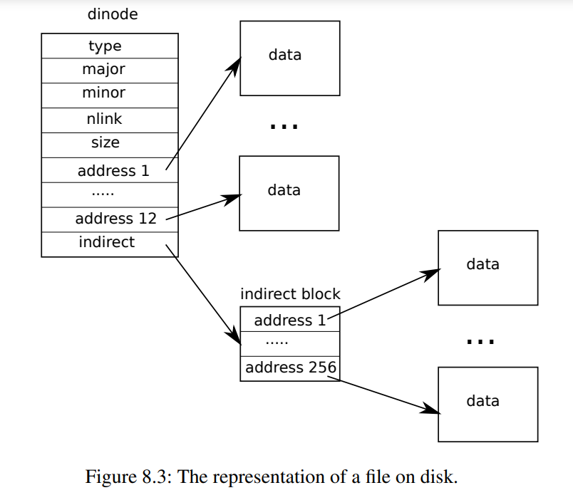

# Inode

索引节点层

术语inode（即索引结点）可以具有两种相关含义之一。它可能是指包含文件大小和数据块编号列表的磁盘上的数据结构。或者“inode”可能指内存中的inode，它包含磁盘上inode的副本以及内核中所需的额外信息。

磁盘上的inode都被打包到一个称为inode块的连续磁盘区域中。每个inode的大小都相同，因此在给定数字n的情况下，很容易在磁盘上找到第n个inode。事实上，这个编号n，称为inode number或i-number，是在具体实现中标识inode的方式。

磁盘上的inode由struct dinode（kernel/fs.h:32）定义。字段type区分文件、目录和特殊文件（设备）。type为零表示磁盘inode是空闲的。字段nlink统计引用此inode的目录条目数，以便识别何时应释放磁盘上的inode及其数据块。字段size记录文件中内容的字节数。addrs数组记录保存文件内容的磁盘块的块号。

内核将活动的inode集合保存在内存中；struct inode（kernel/file.h:17）是磁盘上struct dinode的内存副本。只有当有C指针引用某个inode时，内核才会在内存中存储该inode。ref字段统计引用内存中inode的C指针的数量，如果引用计数降至零，内核将从内存中丢弃该inode。iget和iput函数分别获取和释放指向inode的指针，修改引用计数。指向inode的指针可以来自文件描述符、当前工作目录和如exec的瞬态内核代码。

xv6的inode代码中有四种锁或类似锁的机制。icache.lock保护以下两个不变量：inode最多在缓存中出现一次；缓存inode的ref字段记录指向缓存inode的内存指针数量。每个内存中的inode都有一个包含睡眠锁的lock字段，它确保以独占方式访问inode的字段（如文件长度）以及inode的文件或目录内容块。如果inode的ref大于零，则会导致系统在cache中维护inode，而不会对其他inode重用此缓存项。最后，每个inode都包含一个nlink字段（在磁盘上，如果已缓存则复制到内存中），该字段统计引用文件的目录项的数量；如果inode的链接计数大于零，xv6将不会释放inode。

iget()返回的struct inode指针在相应的iput()调用之前保证有效：inode不会被删除，指针引用的内存也不会被其他inode重用。iget()提供对inode的非独占访问，因此可以有许多指向同一inode的指针。文件系统代码的许多部分都依赖于iget()的这种行为，既可以保存对inode的长期引用（如打开的文件和当前目录），也可以防止争用，同时避免操纵多个inode（如路径名查找）的代码产生死锁。

iget返回的struct inode可能没有任何有用的内容。为了确保它保存磁盘inode的副本，代码必须调用ilock。这将锁定inode（以便没有其他进程可以对其进行ilock），并从磁盘读取尚未读取的inode。iunlock释放inode上的锁。将inode指针的获取与锁定分离有助于在某些情况下避免死锁，例如在目录查找期间。多个进程可以持有指向iget返回的inode的C指针，但一次只能有一个进程锁定inode。

inode缓存只缓存内核代码或数据结构持有C指针的inode。它的主要工作实际上是同步多个进程的访问；缓存是次要的。如果经常使用inode，在inode缓存不保留它的情况下buffer cache可能会将其保留在内存中。inode缓存是直写的，这意味着修改已缓存inode的代码必须立即使用iupdate将其写入磁盘。

为了分配新的inode（例如，在创建文件时），xv6调用ialloc（kernel/fs.c:196）。Ialloc类似于balloc：它一次一个块地遍历磁盘上的索引节点结构体，查找标记为空闲的一个。当它找到一个时，它通过将新type写入磁盘来声明它，然后末尾通过调用iget（kernel/fs.c:210）从inode缓存返回一个条目。ialloc的正确操作取决于这样一个事实：一次只有一个进程可以保存对bp的引用：ialloc可以确保其他进程不会同时看到inode可用并尝试声明它。

Iget（kernel/fs.c:243）在inode缓存中查找具有所需设备和inode编号的活动条目（ip->ref > 0）。如果找到一个，它将返回对该incode的新引用（kernel/fs.c:252-256）。在iget扫描时，它会记录第一个空槽（kernel/fs.c:257-258）的位置，如果需要分配缓存项，它会使用这个槽。

在读取或写入inode的元数据或内容之前，代码必须使用ilock锁定inode。Ilock（kernel/fs.c:289）为此使用睡眠锁。一旦ilock以独占方式访问inode，它将根据需要从磁盘（更可能是buffer cache）读取inode。函数iunlock（kernel/fs.c:317）释放睡眠锁，这可能会导致任何睡眠进程被唤醒。

这段代码来自 **xv6 操作系统**的文件系统实现，函数名为 `iput`。它的核心作用是**释放一个 inode 的引用**。

在 Unix/Linux 文件系统中，inode 是描述文件的核心数据结构。当进程不再需要某个文件（例如关闭文件描述符）时，就会调用 `iput`。

这段代码最精妙的地方在于它处理了**“文件删除”**的逻辑：即当一个文件被删除（`nlink == 0`）且没有进程正在使用它（`ref == 1`）时，如何安全地回收磁盘空间。

---

## 结构

在 xv6 文件系统中，`NDIRECT` 和 `NINDIRECT` 的共存是为了实现**混合索引分配**。这种设计本质上是在**性能**和**文件大小上限**之间寻找一个最佳平衡点。

简单来说：`NDIRECT` 是为了让**小文件**跑得更快，而 `NINDIRECT` 是为了让**大文件**能存得下。

以下是详细的深度解析：

### 1. 核心矛盾：速度与容量

在文件系统中，`inode` 是描述文件的核心数据结构，它的大小是固定的（在 xv6 中通常是 64 字节）。我们需要在这个有限的空间里存储文件的元数据（大小、权限等）以及**文件数据所在的磁盘块号**。

这就面临一个两难的选择：
*   **如果只用直接索引（类似 `NDIRECT`）**：
    *   **优点**：读取数据极快。拿到 inode，直接就能算出数据在哪个块，一次磁盘 I/O 就能读到数据。
    *   **缺点**：容量太小。假设一个块号占 4 字节，64 字节的 inode 除去其他信息，大概只能存 10-12 个块号。这意味着文件最大只有 12KB 左右。这连一个稍微大点的文本文件都存不下。
*   **如果只用间接索引（类似 `NINDIRECT`）**：
    *   **优点**：容量大。通过多级指针，可以轻松支持 GB 甚至 TB 级的文件。
    *   **缺点**：读取数据慢。读一个文件可能需要先读“索引块”，再读“数据块”，增加了磁盘寻道时间（I/O 次数翻倍）。

**混合索引**就是为了解决这个矛盾而生的。

### 2. `NDIRECT`：为小文件加速（局部性原理）

统计表明，文件系统中的文件绝大多数都是**小文件**（如配置文件、脚本、源代码、日志等），大小通常在几 KB 到几十 KB 之间。

*   **设计**：xv6 在 inode 中预留了 `NDIRECT`（通常是 12）个直接块指针。
*   **效果**：只要文件大小在 12KB 以内（12 * 1024 字节），系统就不需要访问任何额外的索引块。
*   **性能提升**：
    1.  **I/O 更少**：读取文件内容只需要 **1 次** 磁盘读取（读数据块本身）。
    2.  **计算更简单**：不需要解析复杂的指针表。

### 3. `NINDIRECT`：突破大小限制

当文件超过 12KB 时，直接块不够用了。这时 `NINDIRECT` 就登场了。

*   **设计**：inode 中留出一个位置（`addrs[12]`），指向一个**间接块**。这个间接块不存数据，而是存“块号列表”。
*   **计算**：
    *   一个磁盘块通常是 1024 字节。
    *   一个块号占 4 字节。
    *   一个间接块可以存 `1024 / 4 = 256` 个块号。
*   **效果**：这额外增加了 256 个数据块的容量（256KB）。
*   **代价**：读取第 13KB 的数据时，需要先读间接块（1次 I/O），再读数据块（1次 I/O），共 **2 次** I/O。虽然慢了，但至少能存大文件了。

### 4. 形象的比喻

你可以把 **inode** 想象成一个**仓库管理员**。

*   **`NDIRECT`（直接索引）**：就像管理员**口袋里**装着的几把钥匙。
    *   如果你要取常用的少量货物（小文件），管理员直接从口袋里掏出钥匙给你，**速度极快**。
*   **`NINDIRECT`（间接索引）**：就像管理员手里的**一本账本**。
    *   如果货物太多，口袋里装不下了，管理员就把多余的货物钥匙记在账本上。
    *   如果你要取这些货物，管理员得**先翻开账本**（读取间接块），找到对应的钥匙位置，然后再去取货。虽然多了一个翻账本的动作，但能管理的货物数量大大增加。

### 5. 总结与扩展

xv6 的这种设计是 Unix 文件系统（UFS）的经典实现：

| 索引类型 | 块数限制 | 容量 (1KB块) | 读取开销 | 用途 |
| :--- | :--- | :--- | :--- | :--- |
| **直接 (`NDIRECT`)** | 12 | 12 KB | 低 (1次 I/O) | 绝大多数小文件，保证系统响应速度 |
| **一级间接 (`NINDIRECT`)** | 256 | 256 KB | 中 (2次 I/O) | 中等大小文件 |
| **二级间接** (进阶) | 256² | 64 MB | 高 (3次 I/O) | 大文件 (xv6 默认未开启，但在 Lab 中会实现) |

**结论**：`NDIRECT` 和 `NINDIRECT` 的组合，利用了**“90% 的文件都是小文件”**这一统计规律，在保证绝大多数文件读写高性能的同时，也保留了支持较大文件的能力。这是一种非常经典的空间换时间（以及时间换空间）的折中设计。

--- 

## iput()

### 代码逐行深度解析

#### 1. 获取全局锁与检查删除条件
```c
  acquire(&icache.lock);

  if(ip->ref == 1 && ip->valid && ip->nlink == 0){
```
- **`acquire(&icache.lock)`**: 首先获取 inode 缓存的全局锁，保护 `icache` 中的共享数据。
- **`if` 条件判断**：这是决定是否真正删除文件的关键。
    - `ip->ref == 1`: 当前调用者是唯一持有该 inode 引用的进程。这意味着没有其他进程正在使用这个文件。
    - `ip->valid`: inode 数据有效。
    - `ip->nlink == 0`: 文件的硬链接数为 0。这意味着文件已经被 `unlink` 系统调用删除了（例如执行了 `rm` 命令）。
- **含义**：如果一个文件被删除了（`nlink==0`），且没有进程在使用它（`ref==1`），那么它就应该被彻底从磁盘上抹去。

#### 2. 锁的转换与释放
```c
    // ip->ref == 1 means no other process can have ip locked,
    // so this acquiresleep() won't block (or deadlock).
    acquiresleep(&ip->lock);

    release(&icache.lock);
```
- **`acquiresleep(&ip->lock)`**: 获取该特定 inode 的睡眠锁。
    - **为什么不会死锁？** 注释解释得很清楚：因为 `ref == 1`，说明只有当前进程持有该 inode，没有其他进程能竞争这个锁，所以 `acquiresleep` 会立即返回。
- **`release(&icache.lock)`**: **关键步骤**。
    - 在持有 `icache.lock` 的同时去执行磁盘 I/O（如下面的 `itrunc`）是非常低效的，会阻塞其他进程对 inode 表的操作。
    - 因此，这里先释放全局锁，只持有该 inode 的私有锁。

#### 3. 执行物理删除
```c
    itrunc(ip);           // 1. 截断文件，释放数据块
    ip->type = 0;         // 2. 标记 inode 类型为空
    iupdate(ip);          // 3. 将更改写回磁盘
    ip->valid = 0;        // 4. 标记内存中的 inode 无效
```
- **`itrunc(ip)`**: 这是一个昂贵的操作。它将文件长度置零，并遍历文件占用的所有数据块索引，将这些磁盘块标记为“空闲”（放回空闲位图中）。
- **`ip->type = 0`**: 将 inode 的类型置为 0（`T_NONE`），表示该 inode 槽位已空。
- **`iupdate(ip)`**: 将修改后的 inode 元数据（`type=0`, `size=0` 等）同步写入磁盘。
- **`ip->valid = 0`**: 标记内存中的这个 inode 结构体不再有效。

#### 4. 恢复锁状态并减少引用
```c
    releasesleep(&ip->lock);

    acquire(&icache.lock);
  }

  ip->ref--;
  release(&icache.lock);
}
```
- **`releasesleep(&ip->lock)`**: 释放 inode 的私有锁。
- **`acquire(&icache.lock)`**: **重新获取全局锁**。
    - 因为代码最后要修改 `ip->ref`，而 `ref` 是受全局锁保护的，所以必须重新拿锁。
- **`ip->ref--`**: 减少引用计数。
    - 如果之前 `ref` 是 1，减完后变成 0。这意味着该 inode 在内存中也没有引用了，可以被后续的操作复用。

---

### 💡 核心设计思想

#### 延迟删除
Unix 文件系统的一个经典特性是：**文件被删除后，如果还有进程打开着它，文件数据并不会立即消失。**
- 当执行 `unlink` 时，只是 `nlink` 减 1。
- 只有当 `nlink == 0` **且** `ref == 0`（即最后一个关闭文件的进程调用 `iput` 时），`iput` 中的 `if` 条件才会成立，真正执行 `itrunc` 删除数据。

#### 锁的粒度优化
代码展示了非常严谨的锁操作顺序：
1. 获取全局锁（检查条件）。
2. 获取局部锁（保护特定 inode）。
3. **释放全局锁**（为了执行耗时的 I/O 操作，不阻塞全局 inode 操作）。
4. 执行 I/O（`itrunc`）。
5. 重新获取全局锁（为了更新引用计数）。

这种“锁转换”技术极大地提高了文件系统的并发性能。

### 📌 总结
`iput` 函数不仅负责减少引用计数，它还负责**垃圾回收**。它是文件系统生命周期管理的终点，确保了当一个文件既“无人引用”又“已被删除”时，其占用的磁盘空间能被正确释放。

iput()和崩溃之间存在一种具有挑战性的交互。iput()不会在文件的链接计数降至零时立即截断文件，因为某些进程可能仍在内存中保留对inode的引用：进程可能仍在读取和写入该文件，因为它已成功打开该文件。但是，如果在最后一个进程关闭该文件的文件描述符之前发生崩溃，则该文件将被标记为已在磁盘上分配，但没有目录项指向它。

文件系统以两种方式之一处理这种情况。简单的解决方案用于恢复时：重新启动后，文件系统会扫描整个文件系统，以查找标记为已分配但没有指向它们的目录项的文件。如果存在任何此类文件，接下来可以将其释放。

第二种解决方案不需要扫描文件系统。在此解决方案中，文件系统在磁盘（例如在超级块中）上记录链接计数降至零但引用计数不为零的文件的i-number。如果文件系统在其引用计数达到0时删除该文件，则会通过从列表中删除该inode来更新磁盘列表。恢复时，文件系统将释放列表中的任何文件。

Xv6没有实现这两种解决方案，这意味着inode可能被标记为已在磁盘上分配，即使它们不再使用。这意味着随着时间的推移，xv6可能会面临磁盘空间不足的风险。


## itrunc

这段代码是 **xv6 操作系统** 中用于**清空文件内容**的核心函数 `itrunc`。

当一个文件被删除（或者被打开截断）时，系统不仅要删除文件名，还必须回收该文件在磁盘上占用的所有数据块，把它们标记为“空闲”，以便后续文件复用。`itrunc` 正是负责这个“打扫战场”工作的。

---

### 🏗️ 背景知识：xv6 的混合索引结构

为了理解这段代码，你需要知道 xv6 的 inode 是如何存储文件数据的（在 `fs.h` 中定义）：

- **`NDIRECT` (通常为 12)**：前 12 个地址 `addrs[0]` 到 `addrs[11]` 直接存储数据块的块号。这叫**直接索引**。
- **`NINDIRECT` (通常为 256)**：第 13 个地址 `addrs[12]` 指向一个**间接块**。这个间接块里存的全是数据块的块号。这叫**一级间接索引**。

`itrunc` 的任务就是遍历这两种索引，把所有指向的数据块都释放掉。

---

### 🧹 第一阶段：释放直接索引的数据块

```c
  for(i = 0; i < NDIRECT; i++){
    if(ip->addrs[i]){
      bfree(ip->dev, ip->addrs[i]);
      ip->addrs[i] = 0;
    }
  }
```

- **逻辑**：遍历 inode 中的前 12 个地址槽位。
- **`if(ip->addrs[i])`**：如果这个槽位不为空（即文件在这个位置有数据）。
- **`bfree(ip->dev, ip->addrs[i])`**：调用 `bfree` 函数。这会将对应的磁盘块号在**磁盘空闲位图**中标记为 0（空闲），表示这块空间可以给别人用了。
- **`ip->addrs[i] = 0`**：清空 inode 内存中的记录，表示该文件不再拥有这个块。

---

### 🧹 第二阶段：释放间接索引的数据块

这是比较复杂的部分，因为涉及到两层释放：先释放数据块，再释放间接块本身。

```c
  if(ip->addrs[NDIRECT]){
    // 1. 读取间接块到内存
    bp = bread(ip->dev, ip->addrs[NDIRECT]);
    a = (uint*)bp->data;
    
    // 2. 遍历间接块中的每一个条目，释放它们指向的真实数据块
    for(j = 0; j < NINDIRECT; j++){
      if(a[j])
        bfree(ip->dev, a[j]);
    }
    
    // 3. 间接块里的数据块都释放完了，现在释放间接块本身
    brelse(bp); // 先把间接块的 buffer 放回缓存池（不再需要了）
    bfree(ip->dev, ip->addrs[NDIRECT]); // 把间接块占用的磁盘空间也释放掉
    
    // 4. 清空 inode 中的记录
    ip->addrs[NDIRECT] = 0;
  }
```

- **`bread`**：因为间接块存储在磁盘上，必须先用 `bread` 把它读入内存缓冲区。
- **内部循环**：间接块本质上是一个数组，里面存着几百个数据块的地址。代码遍历这个数组，把所有真实的数据块都 `bfree` 掉。
- **`bfree` 间接块**：当间接块里指向的所有数据块都被释放后，间接块本身也就没用了，所以最后也要把它释放掉。

---

### 🏁 收尾工作

```c
  ip->size = 0;
  iupdate(ip);
```

- **`ip->size = 0`**：文件长度清零。
- **`iupdate(ip)`**：将修改后的 inode（此时所有的 `addrs` 都是 0，`size` 是 0）写回磁盘。这样即使系统崩溃重启，也能知道这个文件是空的。

---

### 📌 总结

`itrunc` 函数执行了以下逻辑：
1. **扫荡直接块**：把前 12 个直接指向的数据块全部释放。
2. **扫荡间接块**：
    - 找到间接块。
    - 释放间接块里指向的所有数据块。
    - 释放间接块本身。
3. **更新元数据**：将文件大小置零，并同步到磁盘。

它是文件系统空间管理的核心，确保了文件删除后，磁盘空间不会泄露（即变成了“幽灵占用”）。

## iupdate
这段代码是 **xv6 文件系统**中非常关键的 `iupdate` 函数。它的作用是将内存中修改过的 **inode**（索引节点）数据同步回 **磁盘**，确保文件系统的元数据持久化。

简单来说，这是**“保存文件属性”**的最后一步。

---

### 📝 代码逐行解析

#### 1. 定位磁盘块
```c
  bp = bread(ip->dev, IBLOCK(ip->inum, sb));
```
- **`ip->dev`**: 设备号（通常是硬盘）。
- **`ip->inum`**: inode 的编号（即文件在文件系统中的唯一 ID）。
- **`IBLOCK(...)`**: 这是一个宏，用于计算 inode 编号对应的**磁盘块号**。因为一个磁盘块通常能存多个 inode，所以需要通过计算找到它具体在哪一个块里。
- **`bread`**: 读取磁盘块到内存缓冲区。

#### 2. 定位具体的 inode 结构
```c
  dip = (struct dinode*)bp->data + ip->inum%IPB;
```
- **`bp->data`**: 刚才读入的整个磁盘块的数据。
- **`(struct dinode*)`**: 将数据强制转换为磁盘 inode 结构体指针。
- **`ip->inum % IPB`**: 计算该 inode 在这个块中的**偏移量**（索引）。`IPB` 代表 "Inodes Per Block"（每块多少个 inode）。
- **`dip`**: 最终指向了磁盘块中**具体的那个** inode 结构体。

#### 3. 复制数据（内存 -> 磁盘）
```c
  dip->type = ip->type;
  dip->major = ip->major;
  dip->minor = ip->minor;
  dip->nlink = ip->nlink;
  dip->size = ip->size;
  memmove(dip->addrs, ip->addrs, sizeof(ip->addrs));
```
- 这里将内存 inode (`ip`) 中的关键字段复制到磁盘 inode (`dip`) 中。
- **`type`**: 文件类型（普通文件、目录、设备等）。
- **`major/minor`**: 设备号（如果是设备文件）。
- **`nlink`**: 硬链接数。
- **`size`**: 文件大小。
- **`addrs`**: 数据块地址数组（指向文件实际内容的指针）。使用 `memmove` 是因为这是一个数组。

#### 4. 写回磁盘（日志系统）
```c
  log_write(bp);
```
- **关键点**：这里没有直接调用 `bwrite`，而是调用 `log_write`。
- **原因**：xv6 实现了一个简单的**事务日志**系统。为了保证文件系统在崩溃时的一致性（例如，防止写到一半断电导致文件系统损坏），所有的磁盘写入操作都会先记录到日志中。
- `log_write` 标记这个缓冲区为“脏”，并在稍后的事务提交阶段真正写入磁盘。

#### 5. 释放缓冲区
```c
  brelse(bp);
```
- 释放缓冲区锁，允许其他进程访问该磁盘块。

---

### 💡 核心设计思想

#### 内存与磁盘的分离
xv6 为了性能，在内存中维护了一个 inode 缓存（`icache`）。进程操作文件时，修改的是内存中的 `ip`。只有当文件属性改变（如大小变化、重命名、删除）时，才调用 `iupdate` 将更改同步到磁盘。

#### 写通过缓存
注释中提到 `i-node cache is write-through`（实际上 xv6 是通过显式调用 `iupdate` 来实现更新的，并非硬件层面的写通过，但在逻辑上是一致的）。这意味着内存中的修改不会自动反映到磁盘，必须由程序员（内核开发者）显式调用此函数。

#### 崩溃一致性
通过 `log_write`，xv6 确保了 `iupdate` 是原子的。如果系统在写入过程中崩溃，重启后日志系统会重放或回滚这次更新，保证磁盘上的 inode 数据要么完全更新，要么完全没更新，不会出现“写了一半”的中间状态。

### 📌 总结
`iupdate` 是文件系统**持久化**的守门员。它负责把内存中对文件元数据的修改（如文件大小、链接数、数据块指针），安全、原子地写入到磁盘的特定位置。


## Inode包含内容

磁盘上的inode结构体struct dinode包含一个size和一个块号数组（见图8.3）。inode数据可以在dinode的addrs数组列出的块中找到。前面的NDIRECT个数据块被列在数组中的前NDIRECT个元素中；这些块称为直接块（direct blocks）。接下来的NINDIRECT个数据块不在inode中列出，而是在称为间接块（indirect block）的数据块中列出。addrs数组中的最后一个元素给出了间接块的地址。因此，可以从inode中列出的块加载文件的前12 kB（NDIRECT x BSIZE）字节，而只有在查阅间接块后才能加载下一个256 kB（NINDIRECT x BSIZE）字节。这是一个很好的磁盘表示，但对于客户端来说较复杂。函数bmap管理这种表示，以便实现我们将很快看到的如readi和writei这样的更高级例程。bmap(struct inode *ip, uint bn)返回索引结点ip的第bn个数据块的磁盘块号。如果ip还没有这样的块，bmap会分配一个。



函数bmap（kernel/fs.c:378）从简单的情况开始：前面的NDIRECT个块在inode本身中列出（kernel/fs.c:383-387）中。下面NINDIRECT个块在ip->addrs[NDIRECT]的间接块中列出。Bmap读取间接块（kernel/fs.c:394），然后从块内的正确位置（kernel/fs.c:395）读取块号。如果块号超过NDIRECT+NINDIRECT，则bmap调用panic崩溃；writei包含防止这种情况发生的检查（kernel/fs.c:490）。

Bmap根据需要分配块。ip->addrs[]或间接块中条目为零表示未分配块。当bmap遇到零时，它会用按需分配的新块（kernel/fs.c:384-385）（kernel/fs.c:392-393）替换它们。

itrunc释放文件的块，将inode的size重置为零。Itrunc（kernel/fs.c:410）首先释放直接块（kernel/fs.c:416-421），然后释放间接块中列出的块（kernel/fs.c:426-429），最后释放间接块本身（kernel/fs.c:431-432）。

Bmap使readi和writei很容易获取inode的数据。Readi（kernel/fs.c:456）首先确保偏移量和计数不超过文件的末尾。开始于超过文件末尾的地方读取将返回错误（kernel/fs.c:461-462），而从文件末尾开始或穿过文件末尾的读取返回的字节数少于请求的字节数（kernel/fs.c:463-464）。主循环处理文件的每个块，将数据从缓冲区复制到dst（kernel/fs.c:466-474）。writei（kernel/fs.c:483）与readi相同，但有三个例外：从文件末尾开始或穿过文件末尾的写操作会使文件增长到最大文件大小（kernel/fs.c:490-491）；循环将数据复制到缓冲区而不是输出（kernel/fs.c:36）；如果写入扩展了文件，writei必须更新其大小（kernel/fs.c:504-511）。

函数stati（kernel/fs.c:442）将inode元数据复制到stat结构体中，该结构通过stat系统调用向用户程序公开。

## writei

这段代码是 **xv6 文件系统**中用于**向文件写入数据**的核心函数 `writei`。它位于文件系统层，负责将数据从内存（用户空间或内核空间）拷贝到具体的磁盘块中，并处理文件增长、块分配和元数据更新。

以下是详细的代码解析：

### 🛡️ 参数与前置检查
```c
int writei(struct inode *ip, int user_src, uint64 src, uint off, uint n)
```
- **`ip`**: 目标文件的 inode。
- **`user_src`**: 标志位。`1` 表示 `src` 是用户虚拟地址，`0` 表示是内核地址。
- **`src`**: 数据源地址。
- **`off`**: 写入的偏移量（从文件开头算起）。
- **`n`**: 要写入的字节数。

**检查逻辑：**
```c
  if(off > ip->size || off + n < off)
    return -1;
  if(off + n > MAXFILE*BSIZE)
    return -1;
```
1. **`off > ip->size`**: xv6 不支持“空洞”文件（即不允许在文件末尾之后直接写入，导致中间出现空白）。写入必须在当前文件末尾或内部进行。
2. **`off + n < off`**: 检查整数溢出。如果 `off + n` 绕回了比 `off` 还小的值，说明溢出。
3. **`MAXFILE*BSIZE`**: 检查是否超过了文件系统允许的最大文件大小。

### 🔄 循环写入核心逻辑
```c
  for(tot=0; tot<n; tot+=m, off+=m, src+=m){
    bp = bread(ip->dev, bmap(ip, off/BSIZE));
    m = min(n - tot, BSIZE - off%BSIZE);
    // ...
  }
```
这个循环按**块**处理写入请求。因为文件系统是按块（Block）存储的，而写入请求可能是任意字节数。

- **`bmap(ip, off/BSIZE)`**:
    - 这是关键的一步。它根据逻辑块号（`off/BSIZE`）找到对应的**物理磁盘块号**。
    - 如果该逻辑块还没有分配物理块（即文件在增长），`bmap` 会分配一个新的空闲块。
- **`bread(...)`**:
    - 将目标物理块读入内存缓冲区。即使我们是“写入”，通常也需要先“读取”整个块，因为写入可能只是覆盖块的一部分（例如追加写 4 字节到一个 1024 字节的块中）。
- **`m = min(n - tot, BSIZE - off%BSIZE)`**:
    - 计算本次循环实际能写入多少字节。
    - `n - tot`: 还剩多少数据没写。
    - `BSIZE - off%BSIZE`: 当前块内还剩多少空间。
    - 取较小值，确保不跨越块边界。

### 📥 数据拷贝与日志记录
```c
    if(either_copyin(bp->data + (off % BSIZE), user_src, src, m) == -1) {
      brelse(bp);
      break;
    }
    log_write(bp);
    brelse(bp);
```
- **`either_copyin`**:
    - 将数据从源地址（`src`）拷贝到缓冲区数据区（`bp->data`）。
    - 它会根据 `user_src` 判断是否需要处理用户页表（即是否需要从用户空间拷贝）。
    - 如果拷贝失败（例如用户地址非法），返回 -1，循环终止。
- **`log_write(bp)`**:
    - 将修改过的缓冲区标记为“脏”，并写入日志系统（为了崩溃一致性）。
- **`brelse(bp)`**:
    - 释放缓冲区锁。

### 📏 更新文件大小与元数据
```c
  if(off > ip->size)
    ip->size = off;

  iupdate(ip);

  return tot;
```
- **`ip->size = off`**:
    - 如果写入导致文件变长（`off` 超过了原来的 `size`），则更新 inode 中的文件大小记录。
- **`iupdate(ip)`**:
    - **至关重要**。即使文件大小没变，也必须调用 `iupdate`。
    - 原因：循环中的 `bmap` 可能分配了新的物理块（例如从直接块切换到间接块，或者填充了新的直接块），这修改了 `ip->addrs[]` 数组。必须把这些新的块号同步到磁盘上的 inode 中，否则数据就丢了。
- **`return tot`**: 返回实际写入的字节数。

### 📌 总结
`writei` 函数展示了文件系统写入操作的复杂性：
1. **边界检查**：防止非法写入。
2. **按需分配**：通过 `bmap` 动态分配磁盘块。
3. **块对齐处理**：通过循环和 `min` 计算，优雅地处理跨越多个块的写入。
4. **内存管理**：处理用户空间和内核空间的地址差异。
5. **持久化**：通过 `log_write` 和 `iupdate` 确保数据和元数据的安全。

## 目录层

目录的内部实现很像文件。其inode的type为T_DIR，其数据是一系列目录条目（directory entries）。每个条目（entry）都是一个struct dirent（kernel/fs.h:56），其中包含一个名称name和一个inode编号inum。名称最多为DIRSIZ（14）个字符；如果较短，则以NUL（0）字节终止。inode编号为零的条目是空的。

函数dirlookup（kernel/fs.c:527）在目录中搜索具有给定名称的条目。如果找到一个，它将返回一个指向相应inode的指针，解开锁定，并将 *poff 

设置为目录中条目的字节偏移量，以满足调用方希望对其进行编辑的情形。如果dirlookup找到具有正确名称的条目，它将更新*poff并返回通过iget获得的未锁定的inode。Dirlookup是iget返回未锁定indoe的原因。调用者已锁定dp，因此，如果对.，当前目录的别名，进行查找，则在返回之前尝试锁定indoe将导致重新锁定dp并产生死锁(还有更复杂的死锁场景，涉及多个进程和..，父目录的别名。.不是唯一的问题。）调用者可以解锁dp，然后锁定ip，确保它一次只持有一个锁

函数dirlink（kernel/fs.c:554）将给定名称和inode编号的新目录条目写入目录dp。如果名称已经存在，dirlink将返回一个错误（kernel/fs.c:560-564）。主循环读取目录条目，查找未分配的条目。当找到一个时，它会提前停止循环（kernel/fs.c:538-539），并将off设置为可用条目的偏移量。否则，循环结束时会将off设置为dp->size。无论哪种方式，dirlink都会通过在偏移off处写入（kernel/fs.c:574-577）来向目录添加一个新条目。

