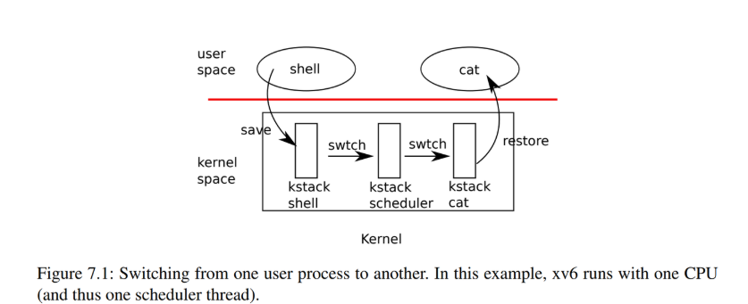

# Multithreading in xv6

## 多路复用

Xv6通过在两种情况下将每个CPU从一个进程切换到另一个进程来实现多路复用Multiplexing
1. 当进程等待设备或者管道IO完成,或等待子进程退出，或在sleep系统调用中等待时,xv6使用睡眠和唤醒机制切换
2. xv6周期性的强制切换以处理长时间计算而不睡眠的进程

Xv6通过标准技术，通过定时器中断驱动上下文切换
许多CPU可能同时在进程之间切换,使用锁方案来避免争用

多核机器的每个核心必须记住它正在执行哪个进程,以便系统调用正确影响对应进程的内核状态
sleep允许一个进程放弃cpu,另一个进程唤醒第一个进程


## 上下文切换



从一个线程切换到另一个线程需要保存旧线程的CPU寄存器，并恢复新线程先前保存的寄存器；栈指针和程序计数器被保存和恢复的事实意味着CPU将切换栈和执行中的代码。

函数swtch为内核线程切换执行保存和恢复操作。swtch对线程没有直接的了解；它只是保存和恢复寄存器集，称为上下文（contexts）。当某个进程要放弃CPU时，该进程的内核线程调用swtch来保存自己的上下文并返回到调度程序的上下文。每个上下文都包含在一个struct context（kernel/proc.h:2）中，这个结构体本身包含在一个进程的struct proc或一个CPU的struct cpu中。Swtch接受两个参数：struct context *old和struct context *new。它将当前寄存器保存在old中，从new中加载寄存器，然后返回。

让我们跟随一个进程通过swtch进入调度程序。我们在第4章中看到，中断结束时的一种可能性是usertrap调用了yield。依次地：Yield调用sched，sched调用swtch将当前上下文保存在p->context中，并切换到先前保存在cpu->scheduler（kernel/proc.c:517）中的调度程序上下文。

Swtch只保存被调用方保存到寄存器,调用方保存的寄存器保存在栈上
swtch保存每个context中寄存器字段偏移,它不保存程序计数器而是swtch的返回地址
swtch从新进程的上下文中恢复寄存器,该上下文保存前一个swtch保存的寄存器值

当swtch返回时,它返回由ra寄存器指定的指令,即新线程以前调用的指令。并且它在新线程的栈上返回

## sched调度

进程 -> sched() -> swtch -> 调度器 -> (选择新进程) -> swtch -> 新进程。
想要放弃cpu的进程必须先获得自己的进程锁p->lock，并释放它持有的任何其他锁,更新自己的状态然后调用sched

sched会对上述条件再次进行检查,并且检查条件对应的隐含条件:由于锁被持有,中断应该被禁止

sched调用swtch将当前上下文保存在p->context中,并切换到cpu->scheduler的调度上下文
Swtch在调度程序的栈上返回,就像scheduler的swtch返回
scheduler继续for循环，找到要运行的进程，切换到该进程，重复循环。

xv6在对swtch的调用中持有p->lock：swtch的调用者必须已经持有了锁，并且锁的控制权传递给切换到的代码。这种约定在锁上是不寻常的；通常，获取锁的线程还负责释放锁，这使得对正确性进行推理更加容易。对于上下文切换，有必要打破这个惯例，因为p->lock保护进程state和context字段上的不变量，而这些不变量在swtch中执行时不成立。如果在swtch期间没有保持p->lock，可能会出现一个问题：在yield将其状态设置为RUNNABLE之后，但在swtch使其停止使用自己的内核栈之前，另一个CPU可能会决定运行该进程。结果将是两个CPU在同一栈上运行，这不可能是正确的。

(持锁是为了防止多CPU间调度不同步导致运行和调度发生竞争)

存在一种情况使得调度程序对swtch的调用没有以sched结束。一个新进程第一次被调度时，它从forkret（kernel/proc.c:527）开始。Forkret存在以释放p->lock；否则，新进程可以从usertrapret开始。

scheduler（kernel/proc.c:457）运行一个简单的循环：找到要运行的进程，运行它直到它让步，然后重复循环。scheduler在进程表上循环查找可运行的进程，该进程具有p->state == RUNNABLE。一旦找到一个进程，它将设置CPU当前进程变量c->proc，将该进程标记为RUNINING，然后调用swtch开始运行它

调度代码为每个进程强制维持一个不变量的集合
并在这些不变量不成立时持有p->lock,其中一个不变量是:
如果一个进程是RUNNABLE状态,空闲CPU的调度程序必须安全地运行它
p->context必须保存进程的寄存器,没有CPU在进程 的内核栈上执行,并且没有CPU 的c->proc引用进程

维护上述不变量是xv6经常在一个线程中获取p->lock并在另一个线程中释放它的原因，例如在yield中获取并在scheduler中释放。一旦yield开始修改一个RUNNING进程的状态为RUNNABLE，锁必须保持被持有状态，直到不变量恢复：最早的正确释放点是scheduler（在其自身栈上运行）清除c->proc之后。类似地，一旦scheduler开始将RUNNABLE进程转换为RUNNING，在内核线程完全运行之前（在swtch之后，例如在yield中）绝不能释放锁。

p->lock还保护其他东西,exit和wait之间的相互竞争,避免丢失wakeup的机制,以及避免一个进程退出和其他进程读写其状态之间的竞争

## mycpu和myproc

Xv6需要指向当前进程的proc结构体的指针
在单处理器系统上,可以有一个指向当前的proc的全局变量
但对于多核系统,每个核执行的进程不同,解决方法是：基于每个核心创建自己的寄存器值，从而使用其中一个寄存器来帮助查找每个核心的信息

Xv6为每个CPU维护一个struct cpu，它记录当前在该CPU上运行的进程（如果有的话），为CPU的调度线程保存寄存器，以及管理中断禁用所需的嵌套自旋锁的计数。函数mycpu (kernel/proc.c:60)返回一个指向当前CPU的struct cpu的指针。RISC-V给它的CPU编号，给每个CPU一个hartid。Xv6确保每个CPU的hartid在内核中存储在该CPU的tp寄存器中。这允许mycpu使用tp对一个cpu结构体数组（即cpus数组，kernel/proc.c:9）进行索引，以找到正确的那个。

Xv6为每个cpu维护一个struct cpu,它记录当前在该cpu上运行的进程,为CPU的调度线程保存寄存器，以及管理中断禁用所需的嵌套自旋锁的计数。函数mycpu (kernel/proc.c:60)返回一个指向当前CPU的struct cpu的指针。RISC-V给它的CPU编号，给每个CPU一个hartid。Xv6确保每个CPU的hartid在内核中存储在该CPU的tp寄存器中。这允许mycpu使用tp对一个cpu结构体数组（即cpus数组，kernel/proc.c:9）进行索引，以找到正确的那个。
确保CPU的tp始终保存CPU的hartid有点麻烦。mstart在CPU启动次序的早期设置tp寄存器，此时仍处于机器模式（kernel/start.c:46）。因为用户进程可能会修改tp，usertrapret在蹦床页面（trampoline page）中保存tp。最后，uservec在从用户空间（kernel/trampoline.S:70）进入内核时恢复保存的tp。编译器保证永远不会使用tp寄存器。如果RISC-V允许xv6直接读取当前hartid会更方便，但这只允许在机器模式下，而不允许在管理模式下。

cpuid和mycpu的返回值很脆弱：如果定时器中断并导致线程让步（yield），然后移动到另一个CPU，以前返回的值将不再正确。为了避免这个问题，xv6要求调用者禁用中断，并且只有在使用完返回的struct cpu后才重新启用。

函数myproc (kernel/proc.c:68)返回当前CPU上运行进程struct proc的指针。myproc禁用中断，调用mycpu，从struct cpu中取出当前进程指针（c->proc），然后启用中断。即使启用中断，myproc的返回值也可以安全使用：如果计时器中断将调用进程移动到另一个CPU，其struct proc指针不会改变。

让我们想象一对调用，sleep和wakeup，工作流程如下。Sleep(chan)在任意值chan上睡眠，称为等待通道（wait channel）。Sleep将调用进程置于睡眠状态，释放CPU用于其他工作。Wakeup(chan)唤醒所有在chan上睡眠的进程（如果有），使其sleep调用返回。如果没有进程在chan上等待，则wakeup不执行任何操作。我们可以将信号量实现更改为使用sleep和wakeup（更改的行添加了注释）：

```c
void V(struct semaphore* s) {
    acquire(&s->lock);
    s->count += 1;
    wakeup(s);
    release(&s->lock);
}

void P(struct semaphore* s) {
    acquire(&s->lock);

    while (s->count == 0)
        sleep(s, &s->lock);  // !pay attention
    s->count -= 1;
    release(&s->lock);
}

```

## Pipes

每个管道都由一个struct pipe表示，其中包含一个锁lock和一个数据缓冲区data。字段nread和nwrite统计从缓冲区读取和写入缓冲区的总字节数。缓冲区是环形的：在buf[PIPESIZE-1]之后写入的下一个字节是buf[0]。而计数不是环形。此约定允许实现区分完整缓冲区（nwrite==nread+PIPESIZE）和空缓冲区（nwrite==nread），但这意味着对缓冲区的索引必须使用buf[nread%PIPESIZE]，而不仅仅是buf[nread]（对于nwrite也是如此）。

让我们假设对piperead和pipewrite的调用同时发生在两个不同的CPU上。Pipewrite（kernel/pipe.c:77）从获取管道锁开始，它保护计数、数据及其相关不变量。Piperead（kernel/pipe.c:103）然后也尝试获取锁，但无法实现。它在acquire（kernel/spinlock.c:22）中旋转等待锁。当piperead等待时，pipewrite遍历被写入的字节（addr[0..n-1]），依次将每个字节添加到管道中（kernel/pipe.c:95）。在这个循环中缓冲区可能会被填满（kernel/pipe.c:85）。在这种情况下，pipewrite调用wakeup来提醒所有处于睡眠状态的读进程缓冲区中有数据等待，然后在&pi->nwrite上睡眠，等待读进程从缓冲区中取出一些字节。作为使pipewrite进程进入睡眠状态的一部分，Sleep释放pi->lock。

现在pi->lock可用，piperead设法获取它并进入其临界区域：它发现pi->nread != pi->nwrite（kernel/pipe.c:110）（pipewrite进入睡眠状态是因为pi->nwrite == pi->nread+PIPESIZE（kernel/pipe.c:85）），因此它进入for循环，从管道中复制数据（kernel/pipe.c:117），并根据复制的字节数增加nread。那些读出的字节就可供写入，因此piperead调用wakeup（kernel/pipe.c:124）返回之前唤醒所有休眠的写进程。Wakeup寻找一个在&pi->nwrite上休眠的进程，该进程正在运行pipewrite，但在缓冲区填满时停止。它将该进程标记为RUNNABLE。

管道代码为读者和写者使用单独的睡眠通道（pi->nread和pi->nwrite）；这可能会使系统在有许多读者和写者等待同一管道这种不太可能的情况下更加高效。管道代码在检查休眠条件的循环中休眠；如果有多个读者或写者，那么除了第一个醒来的进程之外，所有进程都会看到条件仍然错误，并再次睡眠。

## wait和exit,kill

Wait使用调用进程的p->lock作为条件锁，以避免丢失唤醒，并在开始时获取该锁（kernel/proc.c:398）。然后它扫描进程表。如果它发现一个子进程处于ZOMBIE状态，它将释放该子进程的资源及其proc结构体，将该子进程的退出状态码复制到提供给wait的地址（如果不是0），并返回该子进程的进程ID。如果wait找到子进程但没有子进程退出，它将调用sleep以等待其中一个退出（kernel/proc.c:445），然后再次扫描。这里，sleep中释放的条件锁是等待进程的p->lock，这是上面提到的特例。注意，wait通常持有两个锁：它在试图获得任何子进程的锁之前先获得自己的锁；因此，整个xv6都必须遵守相同的锁定顺序（父级，然后是子级），以避免死锁。


ait查看每个进程的np->parent以查找其子进程。它使用np->parent而不持有np->lock，这违反了通常的规则，即共享变量必须受到锁的保护。np可能是当前进程的祖先，在这种情况下，获取np->lock可能会导致死锁，因为这将违反上述顺序。这种情况下无锁检查np->parent似乎是安全的：进程的parent字段仅由其父进程更改，因此如果np->parent==p为true，除非当前流程更改它，否则该值无法被更改，

Exit（kernel/proc.c:333）记录退出状态码，释放一些资源，将所有子进程提供给init进程，在父进程处于等待状态时唤醒父进程，将调用方标记为僵尸进程（zombie），并永久地让出CPU。最后的顺序有点棘手。退出进程必须在将其状态设置为ZOMBIE并唤醒父进程时持有其父进程的锁，因为父进程的锁是防止在wait中丢失唤醒的条件锁。子级还必须持有自己的p->lock，否则父级可能会看到它处于ZOMBIE状态，并在它仍运行时释放它。锁获取顺序对于避免死锁很重要：因为wait先获取父锁再获取子锁，所以exit必须使用相同的顺序。

Exit调用一个专门的唤醒函数wakeup1，该函数仅唤醒父进程，且父进程必须正在wait中休眠（kernel/proc.c:598）。在将自身状态设置为ZOMBIE之前，子进程唤醒父进程可能看起来不正确，但这是安全的：虽然wakeup1可能会导致父进程运行，但wait中的循环在scheduler释放子进程的p->lock之前无法检查子进程，所以wait在exit将其状态设置为ZOMBIE（kernel/proc.c:386）之前不能查看退出进程。

exit允许进程自行终止，而kill（kernel/proc.c:611）允许一个进程请求另一个进程终止。对于kill来说，直接销毁受害者进程（即要杀死的进程）太复杂了，因为受害者可能在另一个CPU上执行，也许是在更新内核数据结构的敏感序列中间。因此，kill的工作量很小：它只是设置受害者的p->killed，如果它正在睡眠，则唤醒它。受害者进程终将进入或离开内核，此时，如果设置了p->killed，usertrap中的代码将调用exit。如果受害者在用户空间中运行，它将很快通过进行系统调用或由于计时器（或其他设备）中断而进入内核。

如果受害者进程在sleep中，kill对wakeup的调用将导致受害者从sleep中返回。这存在潜在的危险，因为等待的条件可能不为真。但是，xv6对sleep的调用总是封装在while循环中，该循环在sleep返回后重新测试条件。一些对sleep的调用还在循环中测试p->killed，如果它被设置，则放弃当前活动。只有在这种放弃是正确的情况下才能这样做。例如，如果设置了killed标志，则管道读写代码返回；最终代码将返回到陷阱，陷阱将再次检查标志并退出。

一些XV6的sleep循环不检查p->killed，因为代码在应该是原子操作的多步系统调用的中间。virtio驱动程序（kernel/virtio_disk.c:242）就是一个例子：它不检查p->killed，因为一个磁盘操作可能是文件系统保持正确状态所需的一组写入操作之一。等待磁盘I/O时被杀死的进程将不会退出，直到它完成当前系统调用并且usertrap看到killed标志
