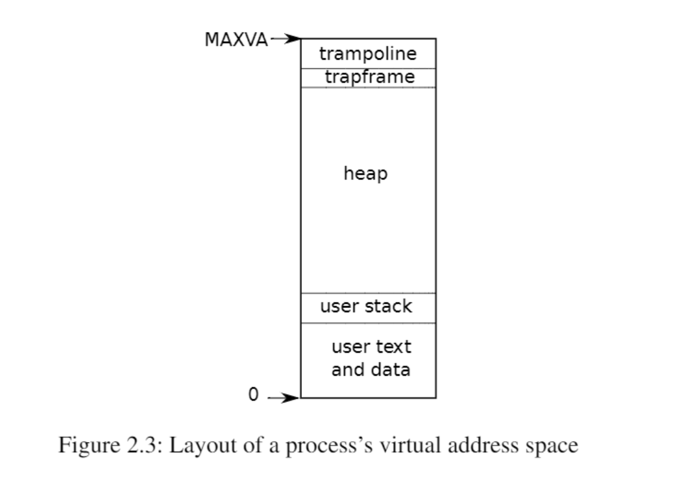

# XV6 Process Management

xv6使用页表(由硬件实现)为每个进程提供自己的地址空间,RISC-V页表将虚拟地址(RISC-V指令操纵的地址)转换为物理地址

Xv6为每一个进程维护一个单独的页表,定义了该进程的地址空间

Xv6为每个进程一个单独的页表,定义了该进程的地址空间,以虚拟内存地址0开始的进程的用户内存地址

指令 | 全局变量 | 栈区 | 堆区域 | 堆区域 以供进程根据需要进行扩展

许多因素限制了进程地址空间的最大范围:RISC-V上的指针有64位宽

RISC-V上的指针有64位宽；硬件在页表中查找虚拟地址时只使用低39位；xv6只使用这39位中的38位。因此，最大地址是2^38-1=0x3fffffffff即MAXVA

xv6 为trampoline 用于 在用户和内核之间切换

xv6内核为每个进程维护许多状态片段，并将它们聚集到一个proc(kernel/proc.h)结构体中。一个进程最重要的内核状态片段是它的页表、内核栈区和运行状态。

每个进程有两个栈区：一个用户栈区和一个内核栈区（p->kstack）。当进程执行用户指令时，只有它的用户栈在使用，它的内核栈是空的。当进程进入内核（由于系统调用或中断）时，内核代码在进程的内核堆栈上执行；当一个进程在内核中时，它的用户堆栈仍然包含保存的数据，只是不处于活动状态。进程的线程在主动使用它的用户栈和内核栈之间交替。内核栈是独立的（并且不受用户代码的保护），因此即使一个进程破坏了它的用户栈，内核依然可以正常运行。

一个进程可以通过执行RISC-V的ecall指令进行系统调用，该指令提升硬件特权级别，并将程序计数器（PC）更改为内核定义的入口点，入口点的代码切换到内核栈，执行实现系统调用的内核指令，当系统调用完成时，内核切换回用户栈，并通过调用sret指令返回用户空间，该指令降低了硬件特权级别，并在系统调用指令刚结束时恢复执行用户指令。进程的线程可以在内核中“阻塞”等待I/O，并在I/O完成后恢复到中断的位置。

p->state表明进程是已分配、就绪态、运行态、等待I/O中（阻塞态）还是退出。

p->pagetable以RISC-V硬件所期望的格式保存进程的页表。当在用户空间执行进程时，Xv6让分页硬件使用进程的p->pagetable。一个进程的页表也可以作为已分配给该进程用于存储进程内存的物理页面地址的记录。

